# Shaluk

## 📝 Overview  
**Shaluk** is a web app designed for **CUET students** to order food and essential medicines from local shops. It eliminates the struggle of finding supplies after evening hours, providing a seamless browsing, searching, and ordering experience. The platform includes an **admin panel** to manage shops, products, and deliveries efficiently.

## 🎯 Motivation  
Students at CUET often face challenges in purchasing food or medicine in the evening due to:

- **Lack of nearby shops** – Essential stores are located outside campus, making access difficult.
- **Dependence on friends** – Students rely on others going outside for tuition to bring necessities.
- **Restricted movement for female students** – The **women’s hall gate closes at 7 PM**, limiting their access to essential supplies.
- **Urgent medical needs** – Students sometimes require immediate medicine but struggle to find it on time.

**Shaluk** addresses these problems by offering a **centralized ordering platform**, allowing students to place orders conveniently while admins ensure timely deliveries.

## 🚀 Key Features  

| Feature                     | Description                                                                                     |
|-----------------------------|-------------------------------------------------------------------------------------------------|
| **🔐 User Authentication**   | Secure login and registration system for students.                                             |
| **🍽️ Food Ordering**        | Browse and order food from local shops inside CUET.                                          |
| **💊 Medicine Ordering**     | Get necessary medicines delivered conveniently.                                               |
| **📊 Admin Dashboard**       | Admins can add shops, products, and confirm deliveries.                                       |
| **📍 Local Shops Only**      | Ensures service reliability by including only CUET-based vendors.                             |

## 🛠️ Technologies & Tools  

| Technology            | Purpose                                      | Link                                               |
|-----------------------|----------------------------------------------|----------------------------------------------------|
| **PostgreSQL**        | Relational database for storing user and product data | [PostgreSQL](https://www.postgresql.org/)         |
| **Express.js**        | Backend framework for API development        | [Express.js](https://expressjs.com/)               |
| **React**             | Frontend framework for building the user interface | [React](https://reactjs.org/)                     |
| **React Redux**       | State management for efficient app performance | [Redux](https://redux.js.org/)                     |
| **GitHub**            | Version control for team collaboration       | [GitHub](https://github.com/)                     |

## 📦 Installation & Setup  

```bash
# Clone the repository
git clone https://github.com/NasrulKarib/Shaluk.git

# Navigate to the project directory
cd shaluk

# Navigate to backend
cd backend

# Install dependencies
npm install

# Navigate to frontend
cd ../frontend

# Install dependencies
npm install

# Start the development server
npm start
```

## Features
### Homepage
The homepage provides an overview of the platform, showcasing restaurants, food, medicines, special offers, and popular items.

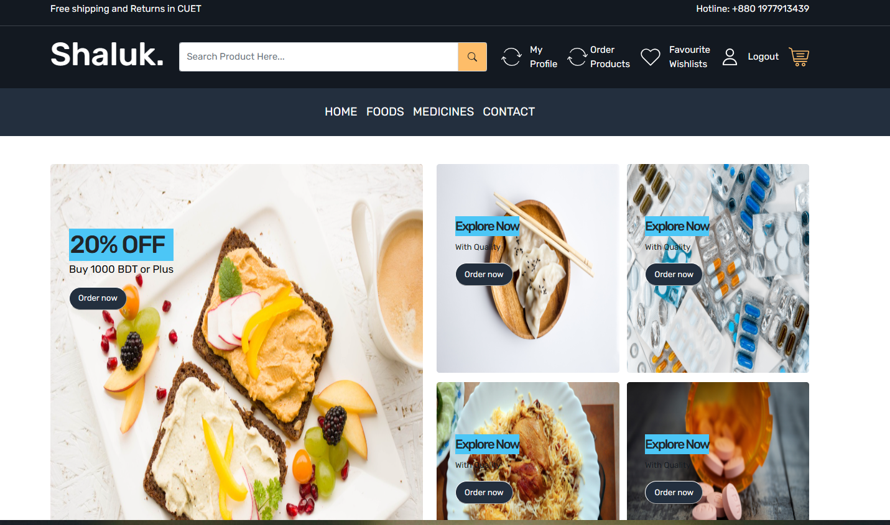
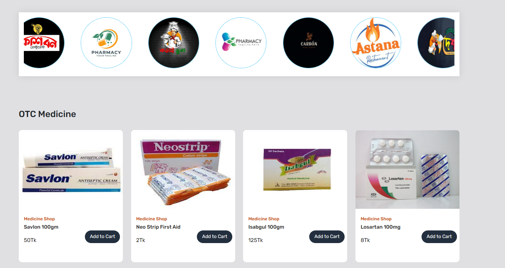
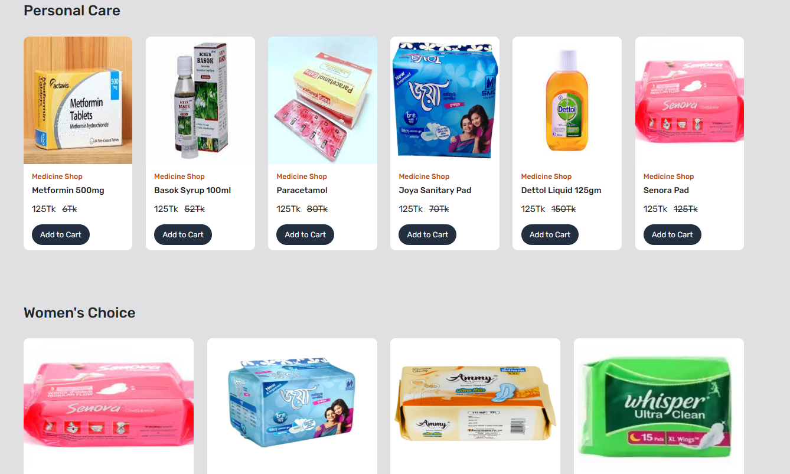
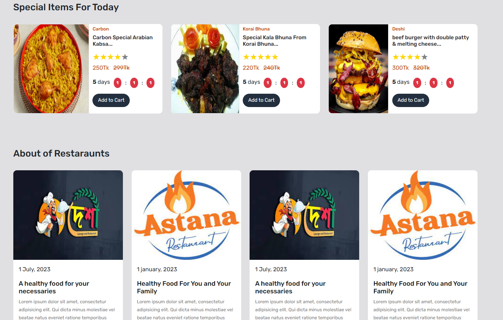
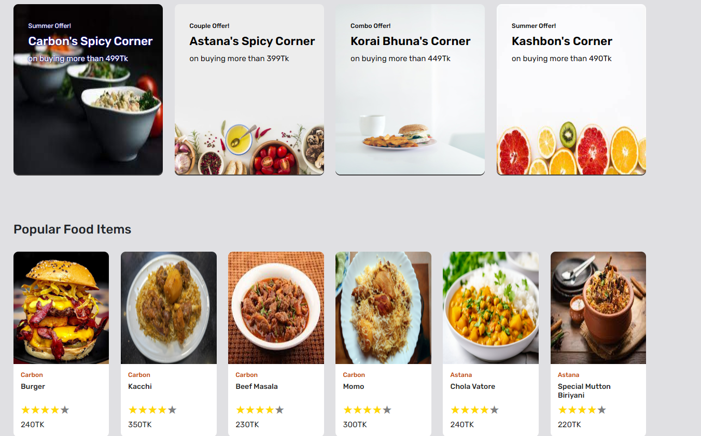
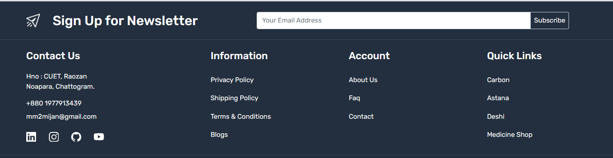

### All Foods and Medicines
Users can browse all food items by clicking on **Food** in the header section. The same applies to **Medicines**.

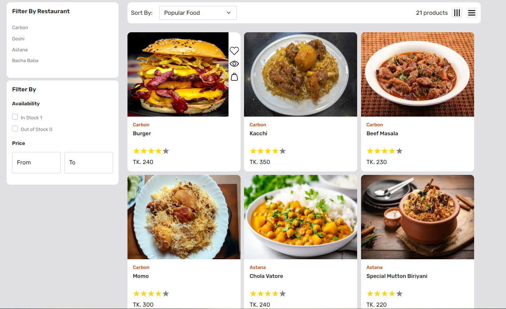
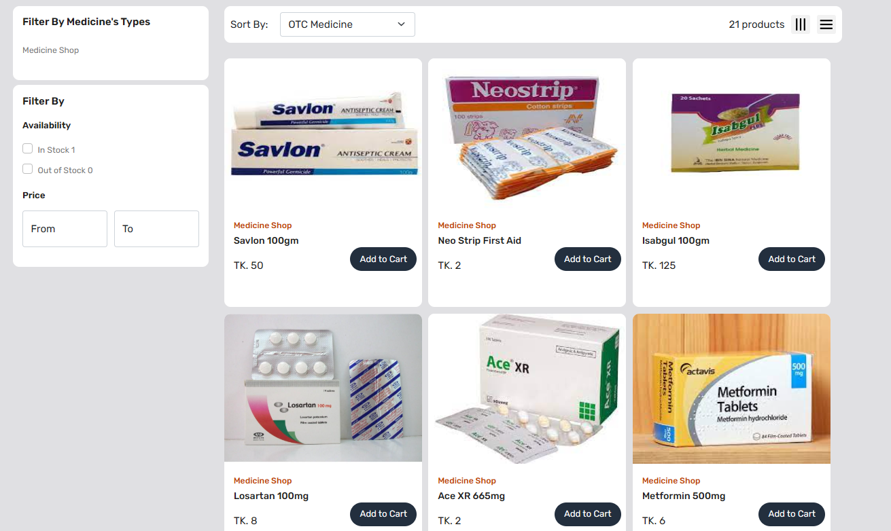

### User Signup
New users can create an account by providing their details.

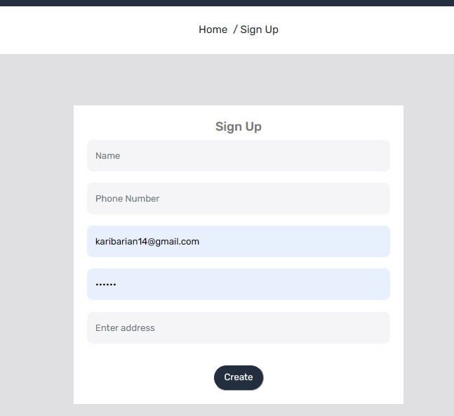

### User Login
Existing users can log in to access their account, order history, and personalized features.

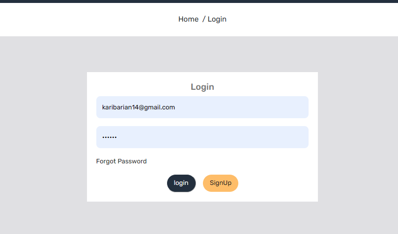

### Admin Dashboard
Admins have access to a dedicated dashboard where they can manage orders, add shops, and add items.

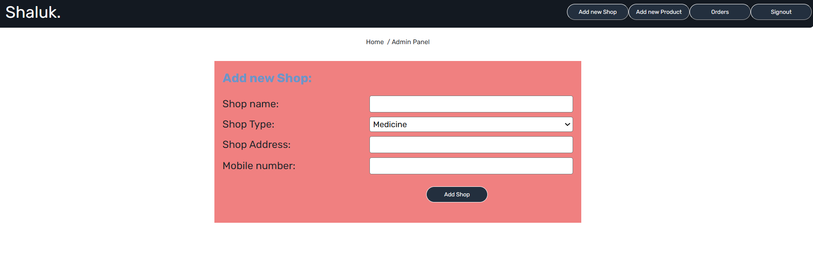
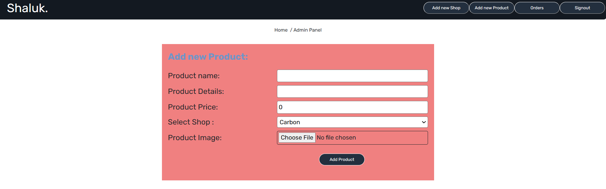
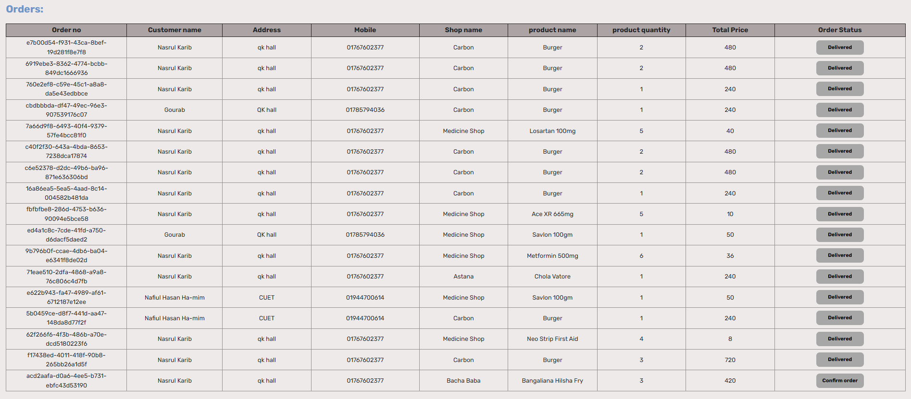

### Add to Cart
Users can add products to the cart, increase quantity, order product and review their past orders.

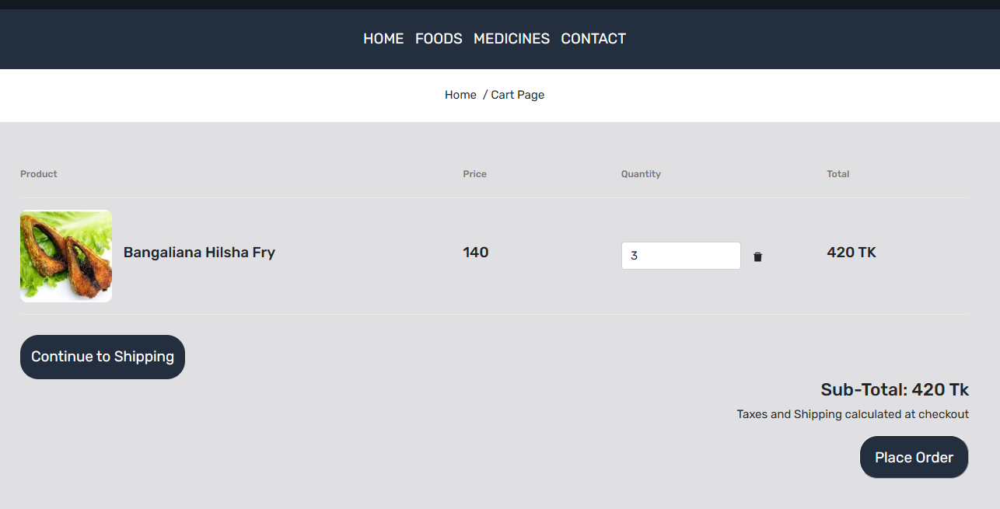
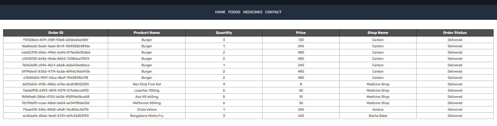

### Description Page
This page provides detailed information about a specific item, including its name, price, rating, and description.

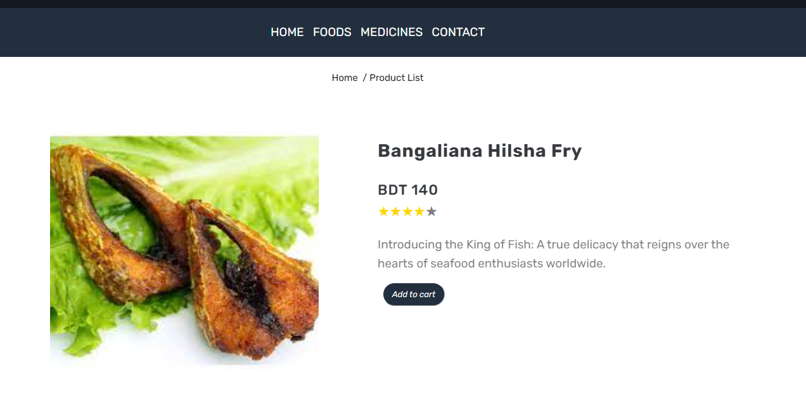

### Shop
This page displays items available from a particular restaurant.

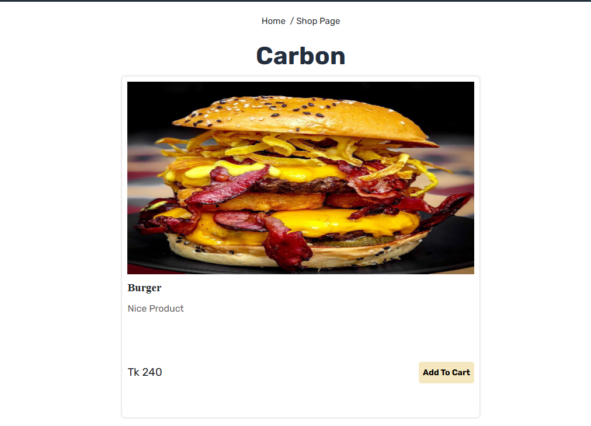

## 🤝 Contributing  
Contributions are welcome! Feel free to open issues or submit pull requests to improve **Shaluk**.  

## 📜 License  
This project is licensed under the **MIT License**. See the `LICENSE` file for more details.

---  
Made with ❤️ for CUET students.
